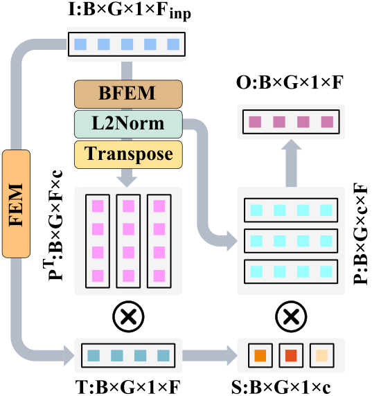
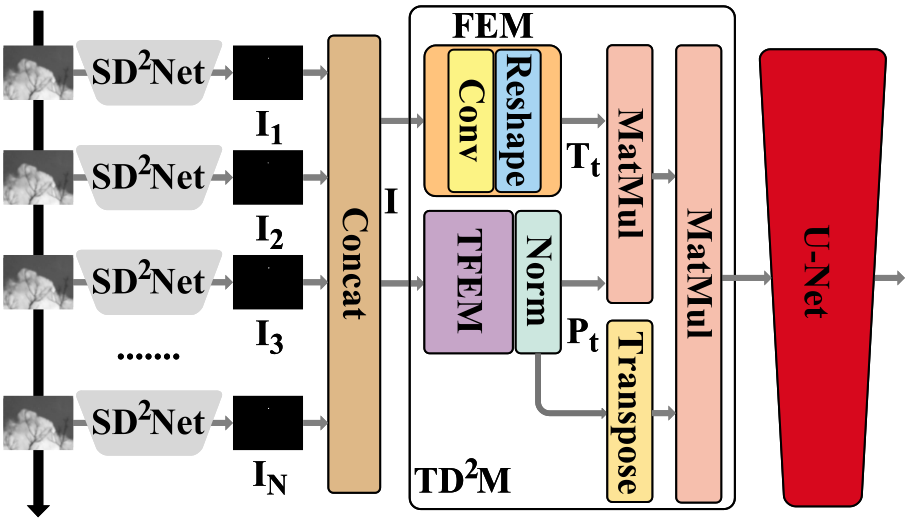

# The code for our newest paper "Difference Decomposition Networks for Infrared Small Target Detection"
The paper can be availble in <https://arxiv.org/abs/2512.03470>.
In addition, the code for STD2Net could be accessible in [STD2Net's code](https://github.com/greekinRoma/STD2Net).
## 1. Backbone 
Our backbone is a structure with 3-level's structure, as shown below.


## 2. Basis Decomposition
As we all know the basis decomposition is fundamental math operation, which could decompose the origin feature into a group of elements.


### 2.1 Difference Basis Decomposition
Based on the Basis Decomposition, we propose the Difference Basis Decomposition for Infrared Small Target Detection (IRSTD), by difference element's decomposing the origin features and enhancing themselves. 


### 2.2 Spatial Difference Basis Decomposition
For the infrared targets' spatial features, we utilize the Spatial Difference Decomposition Module (SD2M) and Spatial Difference Decomposition Downsamplinng (SD2D).


### 2.3 Temporal Difference Basis Decomposition
For the infrared targets' temporal features, we utilize the Temporal Difference Decomposition Module (TD2M).


## 3.GetStart
### 3.1 Checking our best model
```
sh give_the_best_result.sh
```
You input above code into the terminal, and you could get the result of our model by [the weights for IRSTD-1K](best_ckpt/IRSTD-1K/SDecNet.pth.tar) and [the weight for NUDT-SIRST](best_ckpt/NUDT-SIRST).
### 3.2 Dataset
Our dataset would be accessible in [Baidu Cloud](https://pan.baidu.com/s/19DOSJZTHC0KO-wKyGRSldQ?pwd=mxhe) with code of "mxhe".
### 3.3 Environment
The environment could be avalible in [yaml](Environment/environment.yml).
## 4. Reference
```
@misc{hu2026differencedecompositionnetworksinfrared,
      title={Difference Decomposition Networks for Infrared Small Target Detection}, 
      author={Chen Hu and Mingyu Zhou and Shuai Yuan and Hongbo Hu and Zhenming Peng and Tian Pu and Xiying Li},
      year={2026},
      eprint={2512.03470},
      archivePrefix={arXiv},
      primaryClass={cs.CV},
      url={https://arxiv.org/abs/2512.03470}, 
}
```