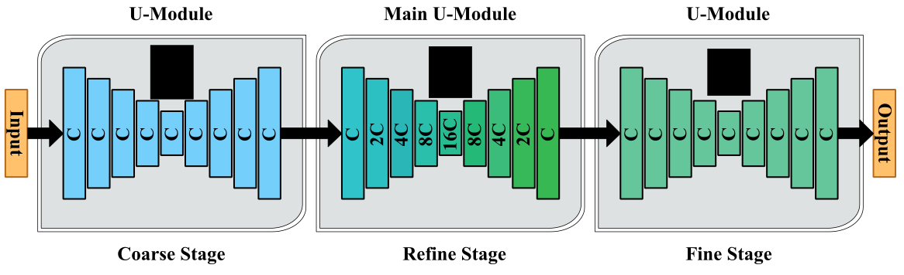
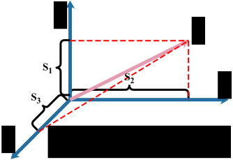
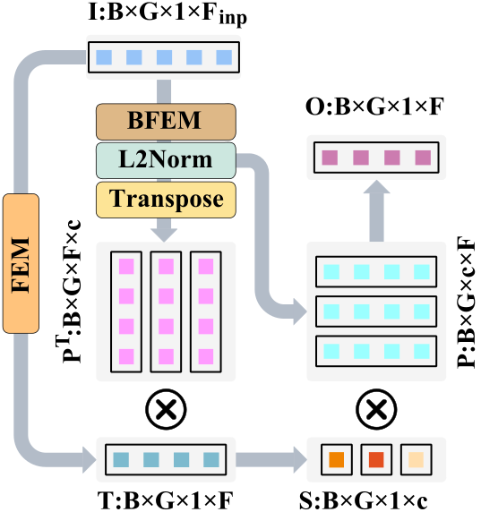
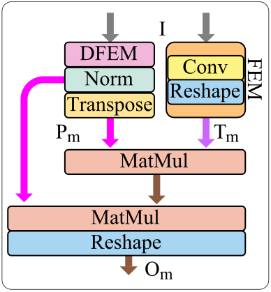
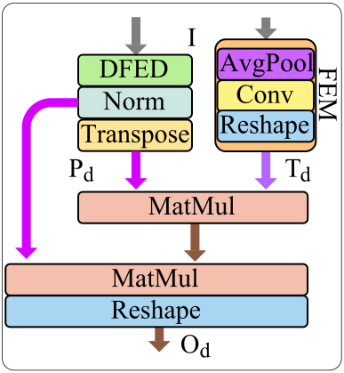
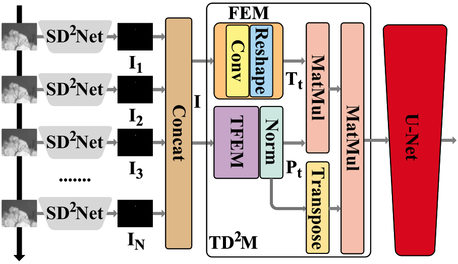

# STGBD-Net: Spatio-Temporal Gradient Basis Decomposition Network for Infrared Small Target Detection

**Official implementation — IEEE TGRS 2026**

[](https://ieeexplore.ieee.org/abstract/document/11554108)
[](https://arxiv.org/abs/2512.03470)
[](LICENSE)
[](https://www.python.org/)

> 🏆 **STGBD-Net** — *IEEE Transactions on Geoscience and Remote Sensing*, vol. 64, 2026.  [[paper]](https://ieeexplore.ieee.org/abstract/document/11554108)
>
> 📄 **Difference Decomposition Networks** — *arXiv: 2512.03470*.  [[paper]](https://arxiv.org/abs/2512.03470)

This repository provides the **complete training, testing, and benchmarking platform** for infrared small target detection (IRSTD), supporting **30+ models** alongside our proposed STGBD-Net. It also includes a dedicated **feature orthogonality analysis toolkit**.

> 🔗 See also: [STD2Net](https://github.com/greekinRoma/STD2Net) — companion work on spatio-temporal difference decomposition.

---

## Table of Contents

- [STGBD-Net at a Glance](#stgbd-net-at-a-glance)
- [Pipeline](#pipeline)
- [Architecture](#architecture)
- [Supported Models](#supported-models)
- [Datasets](#datasets)
- [Quick Start](#quick-start)
- [Training](#training)
- [Testing & Evaluation](#testing--evaluation)
- [Orthogonality Analysis](#orthogonality-analysis)
- [Project Structure](#project-structure)
- [Environment Setup](#environment-setup)
- [Experiment Logs](#experiment-logs)
- [Citation](#citation)
- [License](#license)

---

## STGBD-Net at a Glance

**STGBD-Net** (Spatio-Temporal Gradient Basis Decomposition Network) jointly models **spatial structure** and **temporal motion** for infrared small target detection, which is the main model published in *IEEE TGRS 2026*.

### Why STGBD-Net?

Infrared small target detection faces three fundamental challenges:

| Challenge | STGBD-Net's Solution |
|---|---|
| 🔍 **Weak signal** — targets occupy few pixels with low contrast | **Gradient Decomposition Module (GDM)** amplifies weak target signatures via multi-directional difference operators |
| 🌄 **Complex backgrounds** — clutter edges mimic target appearance | **Basis Decomposition Module (BDM)** disentangles features into orthogonal components, isolating targets from background |
| 🎯 **Temporal consistency** — single-frame methods ignore motion cues | **Temporal Difference Decomposition (TD²M)** captures inter-frame target motion patterns |

### Key Modules

```
STGBD-Net
├── BDM  (Basis Decomposition Module)       — Learnable multi-scale basis extraction
├── GDM  (Gradient Decomposition Module)     — Spatial gradient difference enhancement
├── SD²M (Spatial Difference Decomposition)  — Dilated-conv basis + orthogonalization
├── TD²M (Temporal Difference Decomposition) — Cross-frame motion feature alignment
└── 3-Stage U-Net Backbone                   — Hierarchical encoder-decoder with RSU blocks
```

### Model Variants

| Paper | Code Name | Key Contribution |
|---|---|---|
| 🏆 **IEEE TGRS 2026** | `STBDNet` | Spatio-temporal gradient basis decomposition |
| 📄 arXiv: 2512.03470 | `SDecNet` | Spatial difference basis decomposition |
| | `SDecNet_DHPF` | Spatial decomposition + deep high-pass filter |
| | `SDecNet_Haar` | Spatial decomposition + Haar wavelet |

---

## Pipeline

```
Input Frames (T frames)
       │
       ▼
┌──────────────────────────────────────────────┐
│           Three-Stage U-Net Backbone          │
│  ┌──────┐   ┌──────┐   ┌──────┐             │
│  │Stage1│──▶│Stage2│──▶│Stage3│              │
│  │ RSU-7│   │ RSU-6│   │ RSU-5│  ... RSU-4F  │
│  └──────┘   └──────┘   └──────┘             │
└──────────────────────────────────────────────┘
       │                    ▲
       ▼                    │
┌─────────────────┐  ┌──────┴──────────┐
│   SD²M / SD²D   │  │  UpBlock +      │
│  Spatial Basis  │  │  Skip Connection│
│  Decomposition  │  │  + Attention    │
│  + OrthoLayer   │  └─────────────────┘
└────────┬────────┘
         │
         ▼
┌─────────────────┐
│     TD²M        │  ← Temporal features
│  Cross-frame    │    from adjacent frames
│  Alignment      │
└────────┬────────┘
         │
         ▼
    Output Mask
```

---

## Architecture

### Three-Stage U-Net Backbone

A hierarchical 3-level encoder-decoder with nested dense U-blocks (RSU-7 → RSU-6 → RSU-5 → RSU-4F):



### Basis Decomposition Theory

Feature maps are decomposed into elemental basis vectors — each capturing a distinct aspect of the input signal:



### Gradient Basis Decomposition (GDM)

**Core innovation of STGBD-Net**: differential gradient operators extract multi-scale basis elements; target-relevant components are selectively enhanced via learned cross-attention:



### Spatial Difference Decomposition (SD²M)

Multi-scale basis vectors via dilated convolutions → **Newton-Schulz iterative orthogonalization** → cross-attention recombination:




### Temporal Difference Decomposition (TD²M)

Inter-frame feature alignment and decomposition captures motion signatures of small moving targets:



---

## Supported Models

**30+ models** with a unified interface via [`net.py`](net.py):

| Category | Models |
|---|---|
| ⭐ **Ours** | **`STBDNet`** (TGRS 2026), `SDecNet`, `SDecNet_DHPF`, `SDecNet_Haar` |
| **Classic** | `ACM`, `ALCNet`, `AGPCNet`, `DNANet`, `UIUNet`, `RDIAN`, `ISTDU_Net`, `res_UNet` |
| **Recent SOTA** | `SCTransNet`, `HDNet`, `L2SKNet`, `MSHNet`, `DATransNet`, `SDiffFormer` |
| **RPCA-based** | `RPCANet`, `DRPCANet`, `RPCANet_plus`, `LRPCANet` |
| **Mamba-based** | `MiM`, `VMamba`, `LocalMamba` |
| **SAM-based** | `IRSAM` |
| **Algorithmic** | `TopHat`, `MPCM`, `WSLCM`, `IPI` |

All models share a unified `Net` wrapper — drop-in comparison with a single argument change.

---

## Datasets

| Dataset | Images | Resolution | Split Files |
|---|---|---|---|
| **NUDT-SIRST** | 1,327 | 256×256 | `train_NUDT-SIRST.txt` / `test_NUDT-SIRST.txt` |
| **IRSTD-1K** | 1,001 | 512×512 | `train_IRSTD-1K.txt` / `test_IRSTD-1K.txt` |
| **SIRST-aug** | 8,535 | variable | `train.txt` / `test.txt` |
| **SIRST** | 427 | variable | `trainval.txt` / `test.txt` |
| **NUAA-SIRST** | 585 | variable | `train_NUAA-SIRST.txt` / `test_NUAA-SIRST.txt` |
| **MDFA** | 103 | variable | index-based |

📥 **Download**: [Baidu Cloud](https://pan.baidu.com/s/19DOSJZTHC0KO-wKyGRSldQ?pwd=mxhe) (code: `mxhe`)

Place datasets under `./data/`:

```
data/
├── IRSTD-1K/
│   ├── IRSTD-1K/
│   │   └── XDU_*.png         # images
│   └── masks/                # ground truth
├── NUDT-SIRST/
│   ├── images/
│   └── masks/
└── sirst_aug/
    ├── images/
    └── masks/
```

---

## Quick Start

### One-Command Evaluation

```bash
sh give_the_best_result.sh
```

This script automatically:
1. Checks for dataset availability (prompts download if missing)
2. Runs `test_best.py` — inference with best checkpoints (NUDT-SIRST & IRSTD-1K)
3. Runs `cal_metrics.py` — computes mIoU, PD, FA, F-score, ROC, AUC
4. Saves all results to `./result/`

### Manual Quick Test (STGBD-Net)

```bash
# Test STGBD-Net with pre-trained weights
python test_best.py --model_names STBDNet --dataset_names NUDT-SIRST IRSTD-1K

# Compute full metrics
python cal_metrics.py --model_names STBDNet --dataset_names NUDT-SIRST
```

---

## Training

### Train STGBD-Net

```bash
python train.py \
    --model_names STBDNet \
    --dataset_names NUDT-SIRST \
    --batchSize 4 \
    --nEpochs 400
```

### Multi-Model Benchmark

```bash
python train.py \
    --model_names STBDNet SDecNet DNANet SCTransNet \
    --dataset_names NUDT-SIRST IRSTD-1K SIRST-aug
```

### Full Arguments

| Argument | Type | Default | Description |
|---|---|---|---|
| `--model_names` | `str[]` | `['STBDNet']` | Model(s) to train |
| `--dataset_names` | `str[]` | `['NUDT-SIRST']` | Dataset(s) |
| `--dataset_dir` | `str` | `./data` | Dataset root |
| `--batchSize` | `int` | `4` | Batch size |
| `--nEpochs` | `int` | `400` | Training epochs |
| `--optimizer_name` | `str` | `Adam` | `Adam` / `Adagrad` / `SGD` |
| `--optimizer_settings` | `dict` | `{'lr': 5e-4}` | Optimizer params |
| `--scheduler_name` | `str` | `MultiStepLR` | `MultiStepLR` / `CosineAnnealingLR` |
| `--scheduler_settings` | `dict` | `{'step': [200,300], 'gamma': 0.1}` | Scheduler params |
| `--save` | `str` | `./log5` | Checkpoint output dir |
| `--resume` | `str[]` | `None` | Resume from checkpoint paths |
| `--threshold` | `float` | `0.5` | Test binarization threshold |
| `--seed` | `int` | `42` | Random seed |
| `--threads` | `int` | `1` | DataLoader workers |

### Checkpoints & Logs

```
log5/
├── NUDT-SIRST/
│   └── STBDNet/
│       ├── 200.pth.tar
│       ├── 241.pth.tar     ← best mIoU
│       └── 400.pth.tar
└── NUDT-SIRST_STBDNet_20260627_120000.txt   ← training log
```

### Resume Training

```bash
python train.py \
    --model_names STBDNet \
    --dataset_names NUDT-SIRST \
    --resume log5/NUDT-SIRST/STBDNet/200.pth.tar
```

---

## Testing & Evaluation

```bash
# Inference from training checkpoints
python test.py \
    --model_names STBDNet \
    --dataset_names NUDT-SIRST \
    --test_epos 241

# Inference from best_ckpt/
python test_best.py \
    --model_names STBDNet \
    --dataset_names NUDT-SIRST IRSTD-1K

# Compute metrics from saved predictions
python cal_metrics.py \
    --model_names STBDNet SDecNet \
    --dataset_names NUDT-SIRST
```

### Output Metrics

| Metric | Level | Description |
|---|---|---|
| **mIoU** | Pixel | Mean Intersection over Union |
| **PD** | Target | Probability of Detection (connected-component matching) |
| **FA** | Target | False Alarm rate |
| **Precision / Recall / F-score** | Pixel + Target | Comprehensive detection quality |
| **ROC / AUC** | Target | Receiver Operating Characteristic |

### Loss Functions

| Loss | Used By |
|---|---|
| `SoftIoULoss` | **STBDNet**, SDecNet, DNANet, and most others |
| `DiceLoss` | MiM |
| `ISNetLoss` | Models with edge supervision |
| `MSE + SoftIoU` | RPCA-based models |

### Profiling

```bash
python t_models.py    # FLOPs, #Params, FPS
python t_time.py      # CUDA latency benchmark
```

---

## Orthogonality Analysis

The **feature orthogonalization layer** is a core component of STGBD-Net's BDM module. It uses **Newton-Schulz iterations** to enforce basis vector decorrelation, ensuring informationally efficient feature representations.

The [`orthexperiment/`](orthexperiment/) toolkit provides in-depth analysis:

```bash
# Full analysis (random init)
python orthexperiment/analyze_orthlayer.py --L 10

# Analyze a trained STGBD-Net checkpoint
python orthexperiment/analyze_orthlayer.py \
    --checkpoint log5/NUDT-SIRST/STBDNet/400.pth.tar

# Custom parameters
python orthexperiment/analyze_orthlayer.py \
    --width 32 --height 32 --channels 8 --N 16 --L 10
```

### Analysis Modules

| # | Module | What It Reveals |
|---|---|---|
| 1 | **Weight Analysis** | Learned residual blend ratio (ortho vs. original features) |
| 2 | **Positional Encoding** | Spatial-frequency structure of constant polar bases |
| 3 | **Feature Orthogonality** | Gram matrix eigenvalues, condition number, effective rank (pre/post) |
| 4 | **Iteration Convergence** | Newton-Schulz error decay rate (quadratic convergence ≈ 2.0) |
| 5 | **Per-Channel Analysis** | Which channels benefit most from orthogonalization |

Outputs saved to `orthexperiment/results/`:
```
orthexperiment/results/
├── analysis_summary.json      # All numerical metrics
├── gram_matrix.png            # Pre vs post Gram heatmaps
├── eigenvalue_spectrum.png    # Eigenvalue distribution (log scale)
├── ortho_error_comparison.png # Error reduction bar chart
├── convergence.png            # Iteration convergence curve
└── per_channel.png            # Channel-wise improvement
```

---

## Project Structure

```
IRSTD_HC_Platform/
├── model/                              # 30+ model implementations
│   ├── STBDNet/                        # ⭐ STGBD-Net (IEEE TGRS 2026)
│   │   ├── segmentation.py             #   Network definition
│   │   ├── FDecM/                      #   SD²M, SD²D, NSLayer, SELayer
│   │   │   ├── SDecM.py                #   Spatial Difference Decomposition
│   │   │   ├── SDecD.py                #   Spatial Difference Downsampling
│   │   │   ├── NSLayer.py              #   Matrix power-series orthogonalization
│   │   │   └── Selayer.py              #   Squeeze-and-Excitation
│   │   ├── RSU/                        #   Residual U-Blocks (RSU-7 to RSU-4F)
│   │   ├── AttentionModule/            #   CCA, CPCA, ECA, EMA, non-local blocks
│   │   ├── Gradient_attention/         #   Gradient-guided attention
│   │   └── ...
│   ├── SFBD_Net/                       # Spatial-Freq Basis Decomposition (var.)
│   │   ├── OrthogonalizationLayer/     #   Newton-Schulz iterative orthogonalization
│   │   │   └── OrthLayer.py            #   Core OrthLayer module
│   │   └── ...
│   ├── SDecNet/                        # Spatial difference decomposition
│   ├── DNANet/                         # Dense Nested Attention Network
│   ├── SCtransNet/                     # Spatial-Channel Cross Transformer
│   ├── MiM/ VMamba/ LocalMamba/        # Mamba-based models
│   ├── IRSAM/                          # SAM-based IRSTD
│   ├── RPCANet/ DRPCANet/ ...          # RPCA unfolding models
│   └── ...
├── utils/
│   ├── datasets.py                     # 6 dataset loaders
│   └── images.py                       # Image I/O
├── evaluation/                         # Metric implementations
│   ├── mIoU.py                         # Pixel accuracy + IoU
│   ├── pd_fa.py                        # PD & FA (CC-based)
│   ├── TPFNFP.py                       # Precision, Recall, F-score
│   └── roc_cruve.py                    # ROC & AUC
├── loss.py                             # SoftIoULoss, ISNetLoss, DiceLoss
├── net.py                              # Unified model registry
├── train.py                            # Training entry point
├── test.py                             # Inference (log5/ checkpoints)
├── test_best.py                        # Inference (best_ckpt/)
├── cal_metrics.py                      # Batch metric computation
├── t_models.py                         # FLOPs / params / FPS profiling
├── orthexperiment/                     # Orthogonality analysis toolkit
│   ├── analyze_orthlayer.py            #   5-module analyzer + visualization
│   └── results/                        #   Generated plots & JSON
├── ExperimentExcel/                    # Hyperparameter study logs (CSV)
├── Environment/
│   └── environment.yml                 # Conda env spec
├── best_ckpt/                          # Pre-trained weights
│   ├── IRSTD-1K/best.pth.tar
│   └── NUDT-SIRST/best.pth.tar
├── figs/                               # Architecture diagrams (SVG)
├── log5/                               # Training outputs (gitignored)
├── result/                             # Inference outputs (gitignored)
├── data/                               # Datasets (gitignored)
├── give_the_best_result.sh             # One-command eval script
└── readme.md
```

---

## Environment Setup

### Conda (Recommended)

```bash
conda env create -f Environment/environment.yml
conda activate STDecNet
```

### pip

```bash
pip install torch torchvision
pip install opencv-python scikit-image scikit-learn scipy matplotlib numpy
pip install einops timm thop tqdm pillow pandas h5py
```

### Requirements

| Component | Version |
|---|---|
| Python | ≥ 3.8 |
| PyTorch | ≥ 1.13 (tested: 1.13.1, 2.9.1) |
| CUDA | ≥ 11.0 |
| GPU Memory | ~12 GB (batch_size=4, 256×256) |

---

## Experiment Logs

The [`ExperimentExcel/`](ExperimentExcel/) directory records extensive hyperparameter studies:

| File | Study |
|---|---|
| `L.csv` | Orthogonalization iteration count sweep |
| `num_polar.csv` | Number of polar basis vectors |
| `activate.csv` | Activation function comparison |
| `fusion_type.csv` | Fusion module ablation |
| `basis_num.csv` | Basis count sweep |
| `specturalnorm.csv` | Spectral normalization |
| `orthoLayerv2.csv` | OrthLayer architecture variants |
| `Lwith*.csv` | Learnable vs. fixed L |

---

## Citation

If you use this code, please cite our **IEEE TGRS 2026 paper**:

```bibtex
@ARTICLE{11554108,
  author={Hu, Chen and Zhou, Mingyu and Yuan, Shuai and Hu, Hongbo and
          Peng, Zhenming and Pu, Tian and Li, Xiying},
  journal={IEEE Transactions on Geoscience and Remote Sensing},
  title={STGBD-Net: Spatio-Temporal Gradient Basis Decomposition Network
         for Infrared Small Target Detection},
  year={2026},
  volume={64},
  pages={5006714-5006714},
  doi={10.1109/TGRS.2026.3701189},
}
```

For the preliminary difference decomposition framework, also cite:

```bibtex
@misc{hu2026differencedecompositionnetworksinfrared,
      title={Difference Decomposition Networks for Infrared Small Target Detection},
      author={Chen Hu and Mingyu Zhou and Shuai Yuan and Hongbo Hu and
              Zhenming Peng and Tian Pu and Xiying Li},
      year={2026},
      eprint={2512.03470},
      archivePrefix={arXiv},
      primaryClass={cs.CV},
      url={https://arxiv.org/abs/2512.03470},
}
```

---

## License

MIT License — Copyright (c) 2025 Chen Hu.
